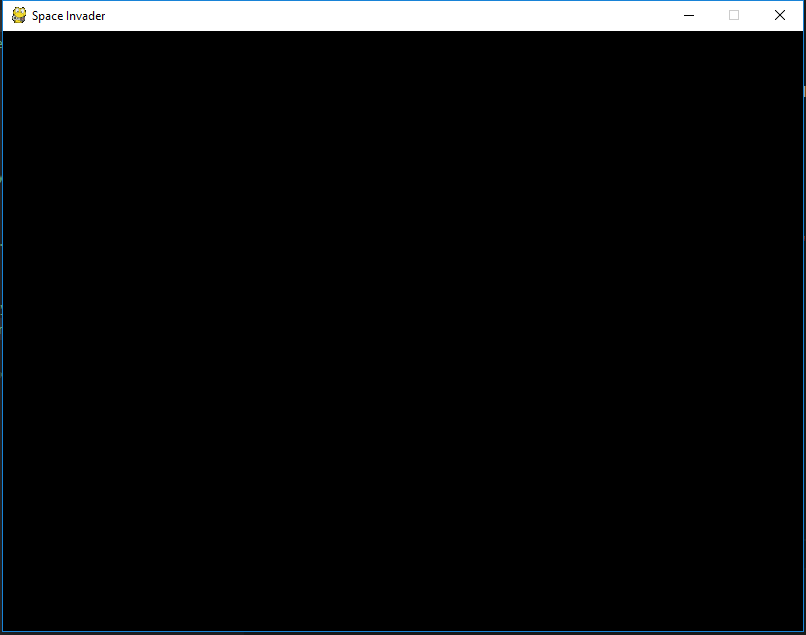

# Space Invaders

[](https://www.python.org)
[](http://www.pygame.org/news.html)
[](https://kennethphang.asia/space-invaders.html)

## Pre-requisite

* Visual Studio Code/Atom
* Python 3

## Install Pygame dependencies

```bash
pip install pygame
```

## Download the artifacts from Gdrive 

1. Unzip all the folders from the zip file into the game project directory.

## Development logbook

1. Create a Game Project directory as spaceinvader
2. Create the following files in the game directory
    * blocker.py
    * bullet.py
    * enemy.py
    * explosion.py
    * bullet.py
    * enemy.py
    * life.py
    * main.py
    * mystery.py
    * ship.py
    * spaceinvader.py
    * text.py

 3. Under the <b>spaceinvader.py</b> create a class, along with the initialize function as shown below. The best way to set custom mixer playback values is to call pygame.mixer.pre_init() before calling the top level pygame.init(). For backward compatibility argument values of zero is replaced with the startup defaults. e.g. frequency=22050, size=-16, channels=2, buffersize=4096

    * init the game engine
    * set the screen resolution to 800 x 600
    * Load the background image to the screeb game 

 ```python
import platform
platform.architecture()
from pygame import *
import sys

SCREEN 	= display.set_mode((800,600))

class SpaceInvaders(object):
    def __init__(self):
        print("init ...")
        mixer.pre_init(44100, -16, 1,512)
        init()
        self.caption = display.set_caption("Space Invader")
        self.background = image.load('images/background.jpg').convert()
        self.screen = SCREEN
        self.mainScreen = True
        self.startGame = False
        self.gameOver = False

    ## check for keyboard input 
    def check_input(self):
        self.keys = key.get_pressed()
        for e in event.get():
            if e.type == QUIT:
                sys.exit()

    ## create game menu
    def create_main_menu(self):
        for e in event.get():
            if e.type == QUIT:
                sys.exit()
            if e.type == KEYUP:
                print("key up")
                self.startGame = True
                self.mainScreen = False

    def main(self):
        print("init ...")
        while True:
            if self.mainScreen:
                print("main screen...")
                self.create_main_menu()
            elif self.startGame:
                print("start game ...")
                sys.exit()
            elif self.gameOver :
                print("game over ...")
        
 ```

4. Run the pygame on your terminal

```bash
python main.py
```



